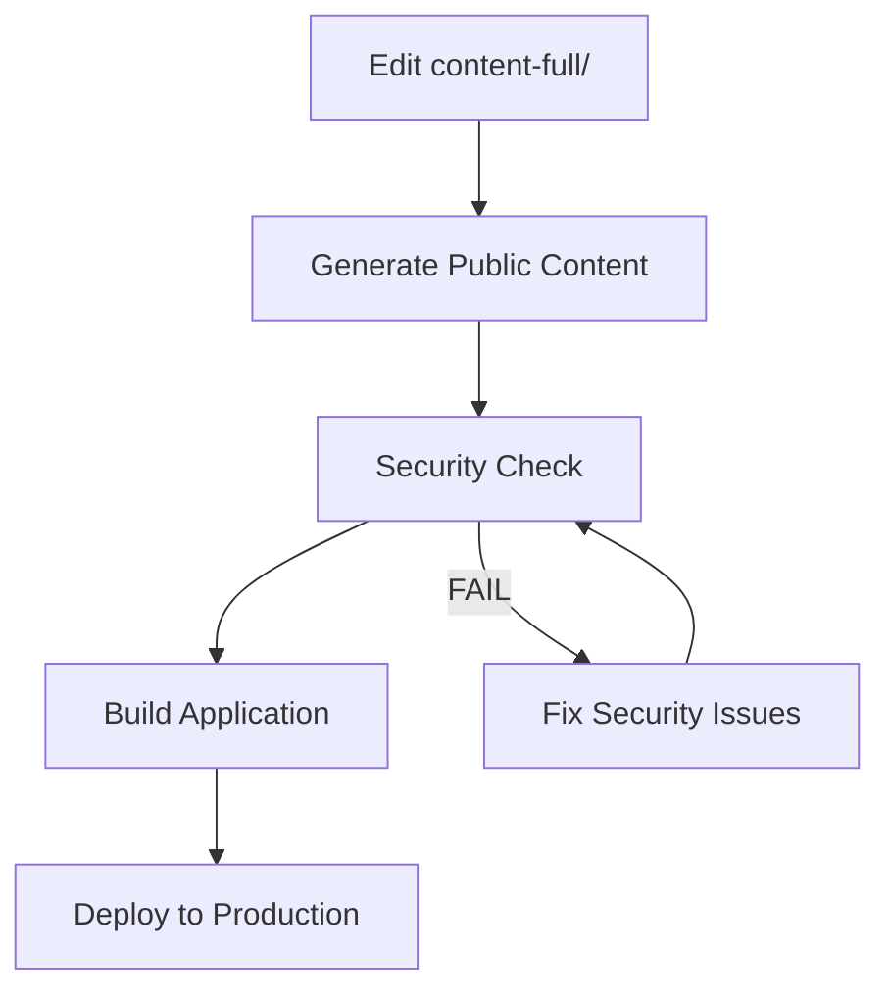

# 🚀 Secure Deployment Guide

## 🎯 Deployment Workflow

### Development to Production Pipeline



### 1. Local Development

**Edit full course content** (protected):
```bash
# Work in content-full/ directory
vim content-full/sip-protocol/advanced-debugging.md
```

**Generate public previews**:
```bash
npm run content:process
```

**Test locally with security**:
```bash
npm run dev:secure
# Opens: http://localhost:3000
```

### 2. Pre-Deployment Validation

**Security validation** (mandatory):
```bash
npm run security:check
```

**Build with security checks**:
```bash
npm run build:secure
```

### 3. Production Deployment

**Vercel Deployment**:
```bash
# Option 1: Secure build then deploy
npm run generate:secure
vercel --prod

# Option 2: Manual verification
npm run security:check
npm run generate
vercel --prod
```

**GitHub Actions** (if using CI/CD):
```yaml
# .github/workflows/deploy.yml
name: Secure Deploy
on:
  push:
    branches: [main]

jobs:
  deploy:
    runs-on: ubuntu-latest
    steps:
      - uses: actions/checkout@v3
      - name: Setup Node
        uses: actions/setup-node@v3
        with:
          node-version: '18'
      - run: npm ci
      - run: npm run security:check
      - run: npm run generate:secure
      - name: Deploy to Vercel
        uses: vercel/action@v1
```

## 🔒 Security Verification

### Pre-Deploy Checklist

- [ ] `npm run security:check` passes
- [ ] Only `content/` directory contains content (not `content-full/`)
- [ ] Public content includes paywall notices
- [ ] No `.full.md` or `-private.md` files in build
- [ ] `.gitignore` includes all sensitive patterns

### Post-Deploy Verification

1. **Check deployed content**:
   ```bash
   curl https://your-site.com/api/_content/query
   ```

2. **Verify paywall notices**:
   - Browse random course pages
   - Confirm content is truncated
   - Verify enrollment CTAs are present

3. **Security audit**:
   ```bash
   # Check that full content is not accessible
   curl https://your-site.com/content-full/
   # Should return 404
   ```

## 🛠️ Platform-Specific Guides

### Vercel

**Project Settings**:
- **Framework**: Nuxt.js
- **Build Command**: `npm run build:secure`
- **Output Directory**: `.output/public`

**Environment Variables**:
```env
NODE_ENV=production
NUXT_PUBLIC_PAYWALL_URL=https://telephonymastery.com/enroll
```

**vercel.json**:
```json
{
  "build": {
    "env": {
      "ENABLE_EXPERIMENTAL_COREPACK": "1"
    }
  },
  "functions": {
    "**/*.js": {
      "runtime": "nodejs18.x"
    }
  }
}
```

### Netlify

**Build Settings**:
- **Build Command**: `npm run generate:secure`
- **Publish Directory**: `dist`

**netlify.toml**:
```toml
[build]
  command = "npm run generate:secure"
  publish = "dist"

[context.production.environment]
  NODE_ENV = "production"

[[redirects]]
  from = "/content-full/*"
  to = "/404"
  status = 404
```

### Custom Server

**Nginx Configuration**:
```nginx
server {
    listen 80;
    server_name telephonymastery.com;
    root /var/www/dist;

    # Block access to sensitive paths
    location ~ ^/(content-full|content-private|content-backup) {
        return 404;
    }

    # Serve static files
    location / {
        try_files $uri $uri/ /index.html;
    }
}
```

## 🔄 Content Management

### Adding New Course Content

1. **Create full content**:
   ```bash
   # Always work in content-full/
   vim content-full/new-module/lesson-1.md
   ```

2. **Process and test**:
   ```bash
   npm run content:process
   npm run dev:secure
   ```

3. **Review public preview**:
   - Check truncation point makes sense
   - Verify paywall notice placement
   - Ensure preview is engaging

4. **Deploy**:
   ```bash
   npm run build:secure
   # Deploy via your platform
   ```

### Updating Existing Content

1. **Edit in content-full/**:
   ```bash
   vim content-full/existing-lesson.md
   ```

2. **Regenerate public version**:
   ```bash
   npm run content:process
   ```

3. **Validate changes**:
   ```bash
   npm run security:check
   git diff content/  # Review public changes
   ```

### Content Rollback

If content needs to be reverted:
```bash
# Restore from backup
cp -r content-backup-TIMESTAMP/lesson.md content-full/lesson.md
npm run content:process
```

## 🚨 Emergency Procedures

### Security Breach Response

1. **Immediate Actions**:
   ```bash
   # Check what's exposed
   npm run security:check
   
   # If full content in Git:
   git reset --soft HEAD~1  # Undo last commit
   git reset content-full/  # Unstage content-full
   ```

2. **Full Content Leak**:
   ```bash
   # Nuclear option - rewrite Git history
   git filter-branch --tree-filter 'rm -rf content-full' HEAD
   git push --force
   ```

3. **Contact Platform Support**:
   - Vercel: support@vercel.com
   - Netlify: support@netlify.com
   - Request immediate content removal

### Content Recovery

```bash
# Restore from backup
ls content-backup-*
cp -r content-backup-LATEST/* content-full/
npm run content:process
npm run security:check
```

## 📊 Monitoring

### Regular Audits

**Weekly**:
- Run `npm run security:check`
- Verify deployed content quality
- Check paywall conversion rates

**Monthly**:
- Review access logs for suspicious patterns
- Audit Git history for sensitive commits
- Update security patterns if needed

**Quarterly**:
- Full security penetration test
- Review and update deployment procedures
- Train team on security protocols

---

**Remember**: Security first! When in doubt, run `npm run security:check` before any deployment. 🔒